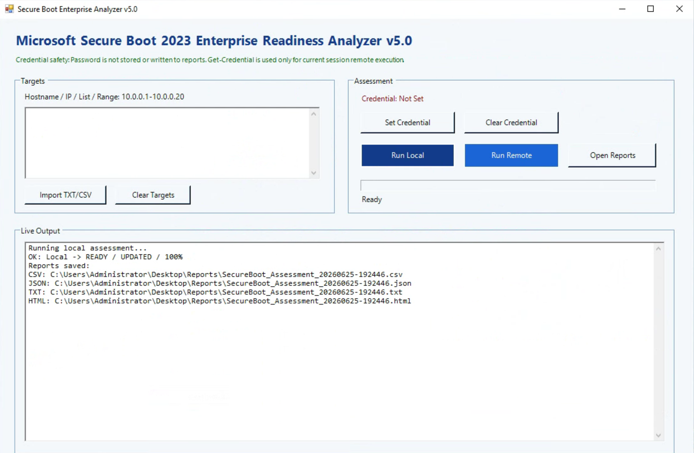
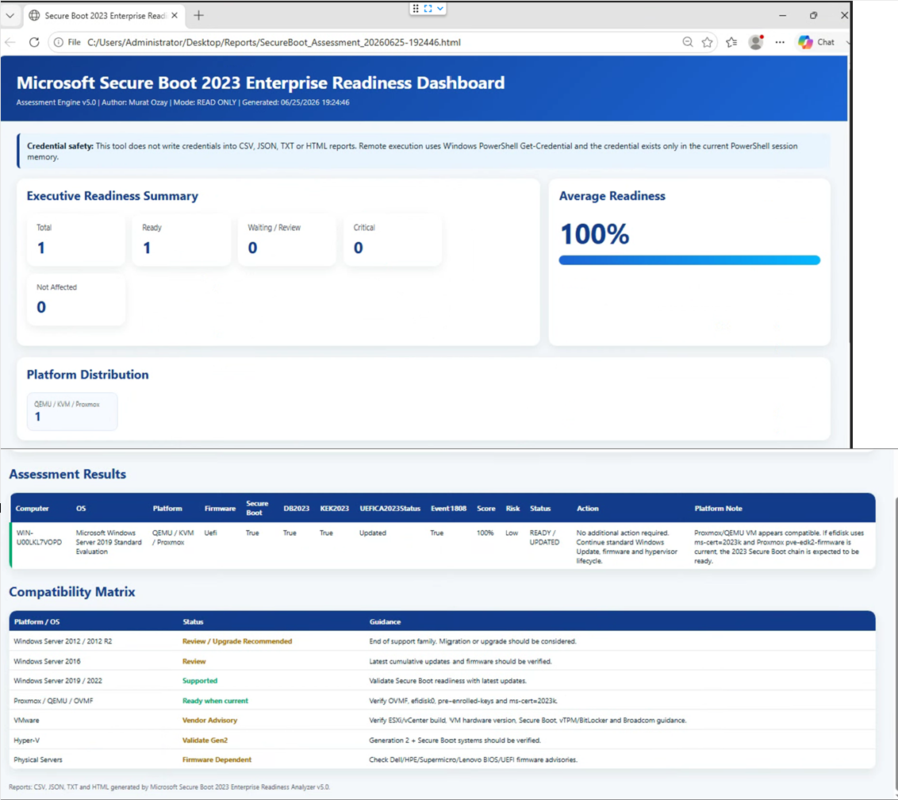
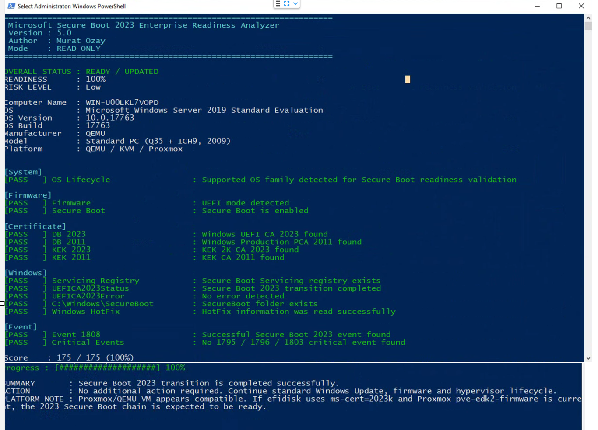

# SecureBoot-Enterprise-Analyzer
Enterprise Readiness Assessment Tool for Microsoft Secure Boot 2023 certificate transition.
# Microsoft Secure Boot 2023 Enterprise Readiness Analyzer

Enterprise readiness assessment tool for Microsoft Secure Boot 2023 certificate transition.

This project provides a **read-only PowerShell based assessment tool** to validate Secure Boot 2023 readiness across Windows Server environments and virtualization platforms.

It is designed for infrastructure teams, hosting providers, system administrators and enterprise IT operations teams.

---

## Overview

Microsoft is transitioning Secure Boot certificate chains from legacy 2011 certificates to newer 2023 certificates.

This tool helps identify whether a Windows system is ready for the Secure Boot 2023 transition by checking:

* Firmware mode
* Secure Boot status
* DB / KEK certificate presence
* Microsoft Secure Boot servicing registry
* Windows update state
* Secure Boot event logs
* Platform type
* Risk level
* Recommended actions

The tool does **not** modify Secure Boot, firmware, registry, certificates or Windows Update settings.

---

## Key Features

* Local assessment
* Remote assessment via PowerShell Remoting / WinRM
* GUI interface
* Console output
* HTML executive dashboard
* CSV export
* JSON export
* TXT export
* Readiness score
* Risk level
* Platform detection
* Compatibility matrix
* Credential-safe execution
* Proxmox / QEMU / KVM detection
* VMware advisory guidance
* Hyper-V advisory guidance
* Physical server firmware guidance

---

## Screenshots

### GUI



### HTML Dashboard



### Console Output



---

## Supported Platforms

| Platform                      | Status             | Notes                                                                |
| ----------------------------- | ------------------ | -------------------------------------------------------------------- |
| Windows Server 2012 / 2012 R2 | Review             | Upgrade or migration recommended                                     |
| Windows Server 2016           | Review             | Latest cumulative updates and firmware should be verified            |
| Windows Server 2019           | Supported          | Tested in lab                                                        |
| Windows Server 2022           | Supported          | Validate with latest updates                                         |
| Windows Server 2025           | Supported          | Validate with latest updates                                         |
| Proxmox VE / QEMU / OVMF      | Supported          | Verify OVMF, EFI disk, pre-enrolled keys and `ms-cert=2023k`         |
| Hyper-V Generation 2          | Supported          | Secure Boot systems should be validated                              |
| VMware ESXi                   | Vendor advisory    | Verify ESXi/vCenter build, VM hardware version and Broadcom guidance |
| Physical Servers              | Firmware dependent | Verify BIOS/UEFI firmware and vendor advisory                        |

---

## Assessment Checks

The analyzer validates:

| Check              | Description                                  |
| ------------------ | -------------------------------------------- |
| OS Lifecycle       | Reviews Windows Server version family        |
| Firmware           | Detects UEFI or Legacy BIOS                  |
| Secure Boot        | Checks Secure Boot status                    |
| DB 2023            | Checks for Windows UEFI CA 2023              |
| DB 2011            | Checks for Windows Production PCA 2011       |
| KEK 2023           | Checks for KEK 2K CA 2023                    |
| KEK 2011           | Checks for KEK CA 2011                       |
| Servicing Registry | Checks Secure Boot servicing registry        |
| UEFICA2023Status   | Reads Microsoft Secure Boot servicing status |
| SecureBoot Folder  | Checks `C:\Windows\SecureBoot`               |
| Windows HotFix     | Reads installed update information           |
| Event 1808         | Checks successful Secure Boot 2023 event     |
| Critical Events    | Checks 1795 / 1796 / 1803 critical events    |

---

## Output Status

| Status              | Meaning                                                 |
| ------------------- | ------------------------------------------------------- |
| READY / UPDATED     | Secure Boot 2023 transition appears completed           |
| READY               | Firmware already contains 2023 Secure Boot certificates |
| ATTENTION / WAITING | Windows servicing may still be pending                  |
| REVIEW REQUIRED     | Manual review recommended                               |
| CRITICAL            | Critical event or error detected                        |
| NOT AFFECTED        | Legacy BIOS or Secure Boot disabled                     |

---

## Reports

Each assessment can generate:

* HTML dashboard
* CSV report
* JSON report
* TXT summary

Reports are generated under the `Reports` folder.

---

## Credential Safety

Remote assessment uses Windows PowerShell `Get-Credential`.

Credentials are:

* Not stored in the script
* Not written to CSV reports
* Not written to JSON reports
* Not written to HTML reports
* Not written to TXT reports
* Used only in the current PowerShell session memory

---

## Remote Assessment Requirements

Remote assessment requires PowerShell Remoting / WinRM.

Target systems must allow remote PowerShell connections.

Recommended requirements:

* WinRM enabled on target systems
* Administrator credentials
* Firewall allowing WinRM
* Domain environment or TrustedHosts configuration
* Use **Run Local** for the current computer

For workgroup or IP-based remote access, TrustedHosts or HTTPS WinRM may be required.

---

## Usage

Run PowerShell as Administrator.

```powershell
Set-ExecutionPolicy Bypass -Scope Process -Force
.\SecureBootEnterpriseAnalyzer.ps1
```

For local computer assessment, use:

```text
Run Local
```

For remote assessment:

1. Enter hostname, IP, list or range
2. Set credential if required
3. Click `Run Remote`

Example target input:

```text
server01
server02
192.168.1.10
192.168.1.20-192.168.1.30
```

---

## Repository Structure

```text
SecureBoot-Enterprise-Analyzer
│
├── Assets
│   ├── Banner
│   ├── Logo
│   └── Screenshots
│
├── Docs
│   ├── Compatibility.md
│   ├── FAQ.md
│   └── Installation.md
│
├── Examples
│   ├── sample.csv
│   ├── sample.html
│   └── sample.json
│
├── Source
│   ├── SecureBootEnterpriseAnalyzer.ps1
│   ├── GUI
│   │   └── MainForm.ps1
│   └── Modules
│       ├── Core.psm1
│       ├── HtmlReport.psm1
│       ├── PlatformDetection.psm1
│       ├── RemoteAssessment.psm1
│       └── Reporting.psm1
│
├── CHANGELOG.md
├── LICENSE
├── README.md
└── SECURITY.md
```

---

## Roadmap

### v5.x

* Improve GUI experience
* Add better connection diagnostics
* Improve WinRM error messages
* Enhance HTML dashboard
* Add additional platform guidance

### v6.x

* Active Directory discovery
* Parallel remote scan
* Enterprise inventory mode
* Better report filtering
* Historical report comparison

### v7.x

* vCenter integration
* Hyper-V cluster discovery
* Proxmox API integration
* REST API output
* ProvisionMind integration

---

## Disclaimer

This project is provided as a read-only assessment tool.

It does not change Secure Boot, UEFI firmware, certificates, registry values, Windows Update configuration or virtualization platform settings.

Always validate results according to your organization's change management and security policies.

---

## License

This project is licensed under the MIT License.

---

## Author

Developed by **Murat Ozay**

Infrastructure, virtualization and enterprise systems research.
